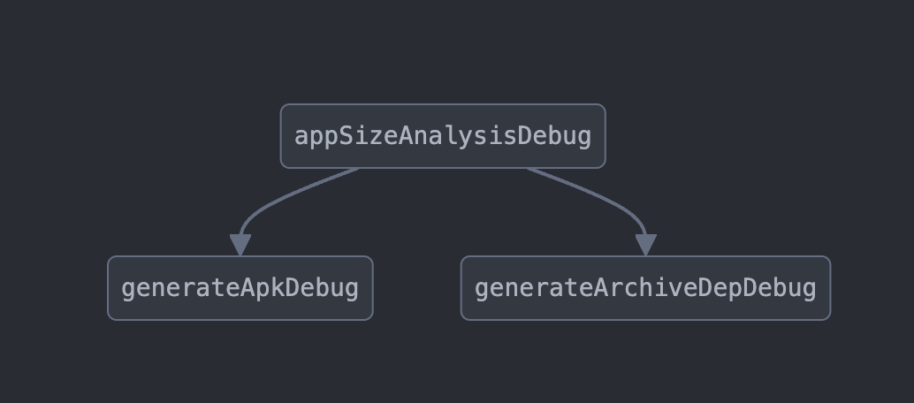

# App Sizer Plugin
App Sizer provide a gradle plugin as the option to seamlessly integrates with your Android Gradle project. This option is recommended.

## Getting Started

There are two ways to integrate the App Sizer plugin into your project:

### Option 1: Plugins DSL (Recommended)

1. Add the mavenCentral to your root `settings.gradle`:
```groovy
pluginManagement {
    repositories {
        mavenCentral()
    }
}
```
2. Add the plugin to your project classpath (root's build.gradle):
```groovy
plugins {
    id "com.grab.sizer" version "0.1.0-alpha01" apply false
}
```
3. Apply and configure the plugin to your app module's build.gradle:
```groovy
plugins {
    id "com.grab.sizer" version "0.1.0-alpha01"
}

appSizer {
    // Configuration goes here
}
```

### Option 2: Legacy buildscript method
1. Add the plugin to your root `build.gradle`
```groovy
buildscript {
    repositories {
        mavenCentral()
    }
    dependencies {
        classpath "com.grab.sizer:sizer-gradle-plugin:0.1.0-alpha01"
    }
}
```
2. Apply the plugin in your app module's `build.gradle`
```groovy
apply plugin: "com.grab.sizer"

appSizer {
    // Configuration goes here
}
```

### Run the analysis

```bash
./gradlew app:apkSizeAnalysis[Release|Debug] --no-configure-on-demand --no-configuration-cache
```
Or if you need to analyze apk files generated from the aab file according to device specs:
```bash
./gradlew app:appSizeAnalysis[Release|Debug] --no-configure-on-demand --no-configuration-cache
```

## Configuration
Use the registered `appSizer` extension block to the app module's `build.gradle` to configure App Sizer Plugin

```groovy
appSizer {
    enabled = true
    projectInput {
        // config the input for the plugin
    }
    metrics {
        // config the output for the plugin
    }
}
```
* **enabled**: Given the App Sizer Plugin has not supported configuration on demand & configuration catching. We provide you an option to turned of the plugin just in case it impact your gradle configuration performance.

### Project Input
Configure the input for the project:

```groovy
appSizer {
    projectInput {
        largeFileThreshold = [your_threshold_in_bytes]
        teamMappingFile = file("path/to/your/module-owner.yml")
        enableMatchDebugVariant = [true|false]
        variantFilter { variant ->
            variant.setIgnore(variant.flavors.contains("your-ignore-flavor"))
        }
        aab {
            // APK Generation from aab
        }
    }
    ...
}
```

| Property | Description                                                    |
|----------|----------------------------------------------------------------|
| `largeFileThreshold` | File size threshold (in bytes) for considering a file as large. |
| `teamMappingFile` | YAML file mapping project modules to team owners.              |
| `enableMatchDebugVariant` | If true, uses debug AAR files to improve build performance.    |
| `variantFilter` | Specifies which variants to exclude from analysis.             |

And example of `teamMappingFile`:

```yaml
Platform:
  - app
Team1:
  - android-module-level1
  - kotlin-module
Team2:
  - sample-group:android-module-level2
```

### APK Generation

Configure APK generation settings:

```groovy
appSizer {
    projectInput {
        ...
        aab {
            deviceSpecs = [
                file("path/to/device-1.json"),
                file("path/to/device-2.json"),
            ]
            bundleToolFile = file("path/to/bundletool.jar")
        }
    }
    ...
}
```

| Property | Description                                                                                                                |
|----------|----------------------------------------------------------------------------------------------------------------------------|
| `deviceSpecs` | List of [device specification](https://developer.android.com/tools/bundletool#generate_use_json) files for APK generation. |
| `bundleToolFile` | Path to the [bundletool](https://github.com/google/bundletool) JAR file.                                                   |

### Output Configuration

Configure the reporting output:

```groovy
appSizer {
    ...
    metrics {
        influxDB {
            dbName = "[your-database-name]"
            reportTableName = "[your-table-name]"
            url = "[url-to-your-influxdb]"
            username = "[your-database-username]"
            password = "[your-database-password]"
        }
        local {
            outputDirectory = [your-output-directory] // Such as project.layout.buildDirectory.dir("app-sizer")
        }
        customAttributes.putAll(
            ["your-custom-attribute-key": "your-custom-attribute-value"]
        )
    }
}
```

| Property | Description                                                                           |
|----------|---------------------------------------------------------------------------------------|
| `local.outputDirectory` | Directory to save markdown and JSON reports (default is `app/build/sizer/reports`)    |
| `customAttributes` | Map of additional attributes to include in every report row. Such as pipeline-id, etc |

#### InfluxDB Configuration

| Property | Description                                         |
|----------|-----------------------------------------------------|
| `dbName` | Name of the InfluxDB database.                      |
| `reportTableName` | Measurement name for storing report data.           |
| `url` | URL of the InfluxDB server.                         |
| `username` | InfluxDB username (optional).                       |
| `password` | InfluxDB password (optional).                       |
| `retentionPolicy` | InfluxDB retention policy configuration (optional). |

## Full Configuration Example

```groovy
appSizer {
    enabled = true
    projectInput {
        aab {
            bundleToolFile = file("${rootProject.rootDir}/binary/bundletool-all-1.15.4.jar")
            deviceSpecs = [
                file("${rootProject.rootDir}/app-size-config/device-1.json"),
                file("${rootProject.rootDir}/app-size-config/device-2.json")
            ]
        }
        variantFilter { variant ->
            variant.setIgnore(variant.flavors.contains("gea"))
        }
        enableMatchDebugVariant = true
        largeFileThreshold = 10
        teamMappingFile = file("${rootProject.rootDir}/module-owner.yml")
    }
    metrics {
        influxDB {
            dbName = "sizer"
            reportTableName = "app_size"
            url = "http://localhost:8086"
            username = "root"
            password = "root"
            retentionPolicy {
                name = "app_sizer"
                duration = "360d"
                shardDuration = "0m"
                replicationFactor = 2
                setAsDefault = true
            }
        }
        local {
            outputDirectory = project.layout.buildDirectory.dir("app-sizer")
        }
        customAttributes.putAll(
            ["pipeline_id": "1001"]
        )
    }
}
```

## Task Graph

<p align="center">

</p>

## Troubleshooting

### Resource Verification Failures
If you encounter issues with the `verifyResourceRelease` task, try these solutions:
- Check that your resource files are properly formatted and located
- Verify that resource names follow Android naming conventions
- Enable the `enableMatchDebugVariant` flag in your configuration

### Dagger NoSuchMethodError
If you encounter this exception:
```java
NoSuchMethodError: 'java.lang.Object dagger.internal.Preconditions.checkNotNullFromProvides'
```
This error typically occurs due to a version conflict between the Android build tools and the App-Sizer plugin's Dagger dependencies. To resolve:

1. Ensure the App-Sizer plugin is added to the classpath in the root build.gradle before applying it to your app module
2. If step 1 doesn't resolve the issue, you might have to resolve the Dagger version conflict by adding this to your classpath
```
classpath "com.google.dagger:dagger:2.47"
```

## Resources

- [Bundletool GitHub Repository](https://github.com/google/bundletool)
- [InfluxDB Documentation](https://www.influxdata.com/time-series-platform/)
