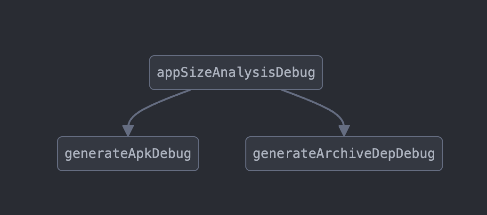

# App Sizer Plugin
App Sizer provide a gradle plugin as the option to seamlessly integrates with your Android Gradle project. This option is recommended.

## Compatibility

| App Sizer Plugin | Android Gradle Plugin | Gradle | JDK |
|------------------|-----------------------|--------|-----|
| 0.2.0-alpha01 and above | 9.0+ | 9.1+ | 17+ |
| 0.1.0-alpha05 and above | 8.13.2+ | 8.13+ | 17+ |
| 0.1.0-alpha03 and below | 8.x | 8.x | 17+ |

The `0.1.x` releases from `0.1.0-alpha05` ship the same features as `0.2.0-alpha01` (including configuration cache support) built against AGP 8.x, for projects that have not migrated to AGP 9 yet. It is maintained on the `support/agp-8.x` branch.

## Getting Started

There are two ways to integrate the App Sizer plugin into your project:

### Option 1: Plugins DSL (Recommended)

1. Add the mavenCentral to your root `settings.gradle`:
```groovy
pluginManagement {
    repositories {
        mavenCentral()
    }
}
```
2. Add the plugin to your project classpath (root's build.gradle):
```groovy
plugins {
    id "com.grab.sizer" version "0.2.0-alpha02" apply false
}
```
3. Apply and configure the plugin to your app module's build.gradle:
```groovy
plugins {
    id "com.grab.sizer" version "0.2.0-alpha02"
}

appSizer {
    // Configuration goes here
}
```

### Option 2: Legacy buildscript method
1. Add the plugin to your root `build.gradle`
```groovy
buildscript {
    repositories {
        mavenCentral()
    }
    dependencies {
        classpath "com.grab.sizer:sizer-gradle-plugin:0.2.0-alpha02"
    }
}
```
2. Apply the plugin in your app module's `build.gradle`
```groovy
apply plugin: "com.grab.sizer"

appSizer {
    // Configuration goes here
}
```

### Run the analysis

```bash
./gradlew app:appSizeAnalysis[Release|Debug] --no-configure-on-demand
```

## Configuration
Use the registered `appSizer` extension block to the app module's `build.gradle` to configure App Sizer Plugin

```groovy
appSizer {
    enabled = true
    projectInput {
        // config the input for the plugin
    }
    metrics {
        // config the output for the plugin
    }
}
```
* **enabled**: Turns the plugin off entirely, in case it impacts your Gradle configuration performance. The plugin supports the configuration cache; configuration on demand is not supported.

### Project Input
Configure the input for the project:

```groovy
appSizer {
    projectInput {
        largeFileThreshold = [your_threshold_in_bytes]
        teamMappingFile = file("path/to/your/module-owner.yml")
        libraryOwnershipFile = file("path/to/your/library-owner.yml")
        enableMatchDebugVariant = [true|false]
        variantFilter { variant ->
            variant.setIgnore(variant.flavors.contains("your-ignore-flavor"))
        }
        apk {
            // APK Generation
        }
    }
    ...
}
```

| Property | Description                                                    |
|----------|----------------------------------------------------------------|
| `largeFileThreshold` | File size threshold (in bytes) for considering a file as large. |
| `teamMappingFile` | YAML file mapping project modules to team owners.              |
| `libraryOwnershipFile` | YAML file mapping external libraries (Maven coordinates) to team owners. Optional. |
| `enableMatchDebugVariant` | If true, uses debug AAR files to improve build performance.    |
| `variantFilter` | Specifies which variants to exclude from analysis.             |

And example of `teamMappingFile`:

```yaml
Platform:
  - app
Team1:
  - android-module-level1
  - kotlin-module
Team2:
  - sample-group:android-module-level2
```

And example of `libraryOwnershipFile`:

```yaml
Platform:
  - androidx.core:*           # all artifacts under the androidx.core group
  - androidx.lifecycle:*
Team1:
  - com.google.android.material:*
  - androidx.navigation:*
Team2:
  - org.jetbrains.kotlin:*
  - org.jetbrains.kotlinx:*
```

Pattern matching is evaluated in this order; the first match wins:

1. **Exact coordinate** — e.g. `androidx.core:core-ktx:1.13.1`
2. **Version-less coordinate** — e.g. `androidx.core:core-ktx` (matches any version of that artifact)
3. **Group wildcard** using `:*` — e.g. `androidx.core:*` (matches any artifact under `androidx.core`)
4. **Group wildcard** using `.*` — e.g. `androidx.*` (matches any group beginning with `androidx.`)

Libraries that do not match any pattern are reported as `NA` in team reports (see [Limitations](./limitation.md)).

### APK Generation

Configure APK generation settings:

```groovy
appSizer {
    projectInput {
        ...
        apk {
            deviceSpecs = [
                file("path/to/device-1.json"),
                file("path/to/device-2.json"),
            ]
            bundleToolFile = file("path/to/bundletool.jar")
        }
    }
    ...
}
```

| Property | Description                                                                                                                |
|----------|----------------------------------------------------------------------------------------------------------------------------|
| `deviceSpecs` | List of [device specification](https://developer.android.com/tools/bundletool#generate_use_json) files for APK generation. |
| `bundleToolFile` | Path to the [bundletool](https://github.com/google/bundletool) JAR file.                                                   |

### Output Configuration

Configure the reporting output:

```groovy
appSizer {
    ...
    metrics {
        influxDB {
            dbName = "[your-database-name]"
            reportTableName = "[your-table-name]"
            url = "[url-to-your-influxdb]"
            username = "[your-database-username]"
            password = "[your-database-password]"
        }
        local {
            outputDirectory = [your-output-directory] // Such as project.layout.buildDirectory.dir("app-sizer")
        }
        customAttributes.putAll(
            ["your-custom-attribute-key": "your-custom-attribute-value"]
        )
    }
}
```

| Property | Description                                                                           |
|----------|---------------------------------------------------------------------------------------|
| `local.outputDirectory` | Directory to save markdown and JSON reports (default is `app/build/sizer/reports`)    |
| `customAttributes` | Map of additional attributes to include in every report row. Such as pipeline-id, etc |

#### InfluxDB Configuration

| Property | Description                                         |
|----------|-----------------------------------------------------|
| `dbName` | Name of the InfluxDB database.                      |
| `reportTableName` | Measurement name for storing report data.           |
| `url` | URL of the InfluxDB server.                         |
| `username` | InfluxDB username (optional).                       |
| `password` | InfluxDB password (optional).                       |
| `retentionPolicy` | InfluxDB retention policy configuration (optional). |

## Full Configuration Example

```groovy
appSizer {
    enabled = true
    projectInput {
        apk {
            bundleToolFile = file("${rootProject.rootDir}/binary/bundletool-all-1.15.4.jar")
            deviceSpecs = [
                file("${rootProject.rootDir}/app-size-config/device-1.json"),
                file("${rootProject.rootDir}/app-size-config/device-2.json")
            ]
        }
        variantFilter { variant ->
            variant.setIgnore(variant.flavors.contains("gea"))
        }
        enableMatchDebugVariant = true
        largeFileThreshold = 10240
        teamMappingFile = file("${rootProject.rootDir}/module-owner.yml")
        libraryOwnershipFile = file("${rootProject.rootDir}/library-owner.yml")
    }
    metrics {
        influxDB {
            dbName = "sizer"
            reportTableName = "app_size"
            url = "http://localhost:8086"
            username = "root"
            password = "root"
            retentionPolicy {
                name = "app_sizer"
                duration = "360d"
                shardDuration = "0m"
                replicationFactor = 2
                setAsDefault = true
            }
        }
        local {
            outputDirectory = project.layout.buildDirectory.dir("app-sizer")
        }
        customAttributes.putAll(
            ["pipeline_id": "1001"]
        )
    }
}
```

## Task Graph

<p align="center">

</p>

## Known Limitations

### Variant Matching

For every Android library module, the plugin selects the build variant matching the analyzed application variant: full name first, then flavor with build type fallbacks, then build type with flavor fallbacks, then the debug build type. The selected variant's `bundle<Variant>Aar` task provides the module's AAR.

When no variant can be matched, the module is **not skipped**: it is analyzed from the granular artifacts Gradle resolves for it (its classes JAR) instead of its assembled AAR, and a warning is logged:

```
AppSize: Could not match a variant for Android library :module-name; it is analyzed from its granular artifacts instead of its AAR
```

The module's classes are still measured and attributed; its resources and assets may not be attributed to it in that mode. Android library modules that are reachable only through an unmatched module fall back to their classes JARs as well, without an individual warning.

### Unmatched Contributors

In team reports, contributors that cannot be matched to `module-owner.yml` or `library-owner.yml` are reported as `NA` instead of being silently reassigned to the `app` module. Module names in `module-owner.yml` must use the full Gradle project path with `:` separators (for example `sample-group:android-module-level2`).

### Configuration on Demand

The plugin resolves dependencies across all modules, so [configuration on demand](https://docs.gradle.org/current/userguide/multi_project_configuration_and_execution.html) is not supported. Run the analysis with `--no-configure-on-demand` if your project enables it. The configuration cache is supported.

## Troubleshooting

1. **"Could not match a variant for Android library [module-name]"**
   - **Cause**: The library module lacks a variant matching the app's flavor/buildType configuration
   - **Solution**: Add `matchingFallbacks` to the library module or ensure consistent flavor/buildType naming; otherwise the module is analyzed from its classes JAR (see Known Limitations)

2. **"enableMatchDebugVariant is set but the [configuration] does not exist"**
   - **Cause**: The debug runtime classpath for the matched flavor is missing
   - **Solution**: Module archives fall back to the analyzed variant automatically; disable `enableMatchDebugVariant` if this is unexpected

3. **Modules show `NA` owners in the team report**
   - **Cause**: The contributor name does not match any entry in `teamMappingFile`/`libraryOwnershipFile`
   - **Solution**: Use full project paths (`group:module`) in `module-owner.yml` and group-anchored patterns (`com.example:*`) in `library-owner.yml`

### Resource Verification Failures
If you encounter issues with the `verifyResourceRelease` task, try these solutions:
- Check that your resource files are properly formatted and located
- Verify that resource names follow Android naming conventions
- Enable the `enableMatchDebugVariant` flag in your configuration

### Missing Analysis Data

If modules appear to be missing from your analysis reports:

1. **Check Warning Logs**: Look for "analyzed from its granular artifacts" messages in build output
2. **Enable Debug Mode**: Run with `--debug` to get detailed variant matching information

### Dagger NoSuchMethodError (plugin versions up to 0.2.0-alpha01)
If you encounter this exception:
```java
NoSuchMethodError: 'java.lang.Object dagger.internal.Preconditions.checkNotNullFromProvides'
```
It was caused by a Dagger version conflict with another build tool on the buildscript classpath. The plugin no longer depends on Dagger, so this error cannot occur on newer versions: upgrade the App Sizer plugin. If you are pinned to an affected version, force a recent Dagger on the root buildscript classpath as a workaround:
```
classpath "com.google.dagger:dagger:2.60.1"
```

### Debug Mode Analysis

Run with debug logging to get detailed information about module processing, variant matching, and potential issues:

```bash
./gradlew appSizeAnalysisRelease --debug 2>&1 | grep -E "(AppSize|variant)"
```

This will filter the output to show only variant matching and module processing information.

## Resources

- [Bundletool GitHub Repository](https://github.com/google/bundletool)
- [InfluxDB Documentation](https://www.influxdata.com/time-series-platform/)
