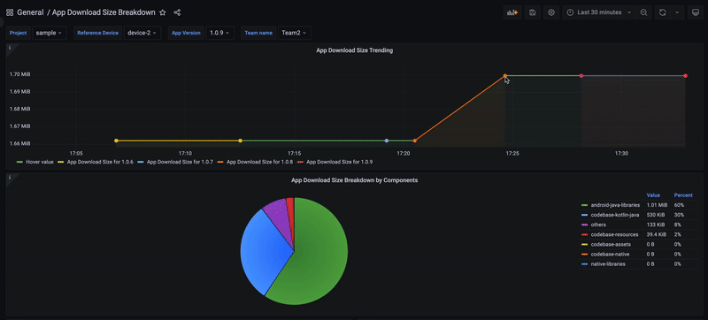

# App Sizer

See the [project website][app-sizer] for documentation and APIs.

## Overview
App Sizer is a tool designed to analyze the download size of Android applications. By providing detailed insights into the composition of your app's binary, App Sizer helps developers identify areas for size reduction, ultimately improving user acquisition and retention rates.
 
  *The app download size in Android refers to the amount of data a user needs to download from an app store (typically Google Play Store) to install an application on their Android device*

<p align="center">

</p>
## Key Features

App Sizer offers comprehensive analysis including:
1. Total app download size
2. Detailed size breakdown
3. Size contribution by teams
4. Module-wise size contribution
5. Size contribution by libraries
6. List of large files

 Report are generated based on the provided device configuration.  

## Integration Options

App Sizer provides two flexible integration methods:

* A Gradle plugin that seamlessly integrates with your Android Gradle project.
* A command-line tool to cater to non-Gradle build systems, offering the same comprehensive features.

  *Note: The command-line option was the original implementation and remains supported for broader compatibility.*

## Report Types

App Sizer currently supports three types of reports:

* Markdown table for convenient local analysis.
* InfluxDB database (1.x) - suitable for CI tracking and enabling the creation of customized dashboards. 
* JSON data for compatibility with other platforms.

We are actively working on expanding our database support to accommodate a wider range of database platform.

## Components
* [Gradle Plugin][gradle-plugin]
* [Command line tool][commandline-tool]
* [InfluxDb & Grafana Docker][grafana-docker]


## How it works
App Sizer functions as a mapping tool to generate the report. It takes APK, AAR, and JAR files as inputs.
1. **Input parsing**:
  - The tool parses the APK down to file and class levels. It calculates the contribution of each component to the total app download size.
  - Similarly, App Sizer parses AAR and JAR files.
2. **Mapping and Report Generation**:
  - The tool then maps the APK components to their corresponding elements in the AAR and JAR files.
  - Based on this analysis and other metadata, App Sizer generates comprehensive reports detailing size contributions.

## Limitation
* Class size: It's challenging to calculate the download size of a class from the APK. 
Instead, we can obtain a relative [size of the class definition][class-size] (termed 'raw size'), and the Dex file download size. 
From this, we derive a relative value for the class's download size:
```text
class's download size = class raw file * (dex download size / all classes' raw size).
```
It's interesting that the tool was built independently, but the same approach also being applied to the other tool in the community 

* **resources.arsc**: is a file in an Android APK which contains precompiled resources, such as binary XML (like strings, arrays, and other value types defined in XML), into a binary format for more efficient access and use by the app on a device.
It is not analysed during analytics and is grouped under "others". Hence, for a small Android project, this value might disproportionately impact the data, creating the illusion of an inefficient tool.


## Gradle Plugin Integration
In root `build.gradle`:

```groovy
buildscript {
    repositories {
        mavenCentral()
    }
    dependencies {
        classpath "com.grab:app-sizer:SNAPSHOT"
    }
}
```
In the app module 's `build.gradle`
```groovy
apply plugin: "com.grab.app-sizer"

// AppSizer configuration
appSizeAnalysis {
    // DSL
}
```

To run analysis, execute

```
./gradlew app:appSizeAnalysisRelease --no-configure-on-demand
```

For plugin configuration options, see [Plugin Configuration](docs/plugin.md).

## Cli tool
To generate the command line binary file, execute
```text
./gradlew clt:shadowJar
```

To run analysis using the command line tool, execute
```text
java -jar clt-all.jar --config-file ./path/to/config/app-size-settings.yml
```

For command line configuration options, see [Commandline Configuration](docs/cli.md).

## License

```
Copyright 2024 Grabtaxi Holdings PTE LTD (GRAB)

Licensed under the Apache License, Version 2.0 (the "License");
you may not use this file except in compliance with the License.
You may obtain a copy of the License at

    http://www.apache.org/licenses/LICENSE-2.0

Unless required by applicable law or agreed to in writing, software
distributed under the License is distributed on an "AS IS" BASIS,
WITHOUT WARRANTIES OR CONDITIONS OF ANY KIND, either express or implied.
See the License for the specific language governing permissions and
limitations under the License.
```


[app-sizer]: TBA
[gradle-plugin]: TBA
[commandline-tool]: TBA
[grafana-docker]: TBA
[class-size]: https://github.com/JesusFreke/smali/blob/master/dexlib2/src/main/java/org/jf/dexlib2/dexbacked/DexBackedClassDef.java#L505
